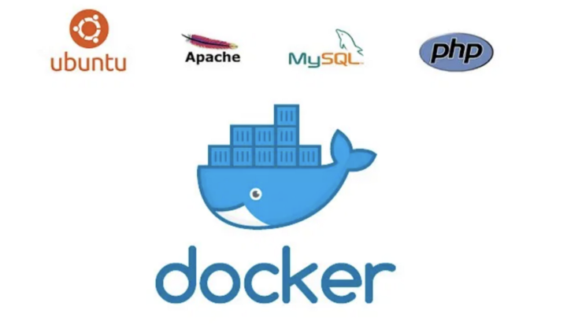

# Docker-php-apache-mysql




A pretty simplified Docker Compose workflow that sets up a LAMP (Linux, Apache ,MySQL, PHP) network of containers for local Laravel development or php projects with Apache.

## Ports

Ports used in the project:
| Software | Port |
|-------------- | -------------- |
| **php-apache** | 80 |
| **mysql** | 3306 |
| **xdebug** | 9000 |

## Use

To get started, make sure you have [Docker installed](https://docs.docker.com/) on your system and [Docker Compose](https://docs.docker.com/compose/install/), and then clone this repository.

1. Clone this project:

   ```sh
   git clone https://github.com/supermavster/docker-laravel-8.git
   ```

2. Inside the folder `docker-php-apache-mysql` and Generate your own `.env` to docker compose with the next command:

   ```sh
   cp .env.example .env
   ```

3. You need **Create** or **Put** your laravel project in the folder `src`; to create follow the next instructions [Here](src/README.md).

4. Build the project whit the next commands:

   ```sh
   docker-compose up --build -d
   ```

---

## Remember

The configuration of the database **must be the same on both sides** .

```dotenv
# .env
DB_CONNECTION=mysql
DB_HOST=127.0.0.1
DB_PORT=3306
DB_DATABASE=db_name
DB_USERNAME=db_user
DB_PASSWORD=db_password
DB_ROOT_PASSWORD=secret
```

```dotenv
# src/.env
DB_CONNECTION=mysql
DB_HOST=mysql
DB_PORT=3306
DB_DATABASE=db_name
DB_USERNAME=db_user
DB_PASSWORD=db_password
```

The only change is the `DB_HOST` in the `src/.env` where is called to the container of `mysql`:

```dotenv
# source/.env
DB_HOST=mysql
```

---